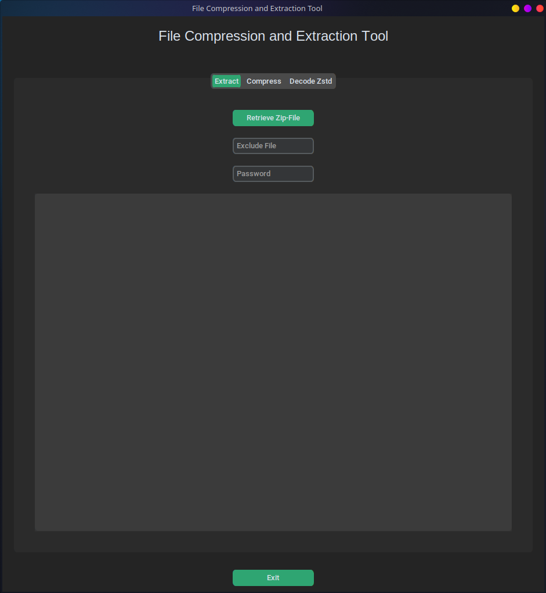
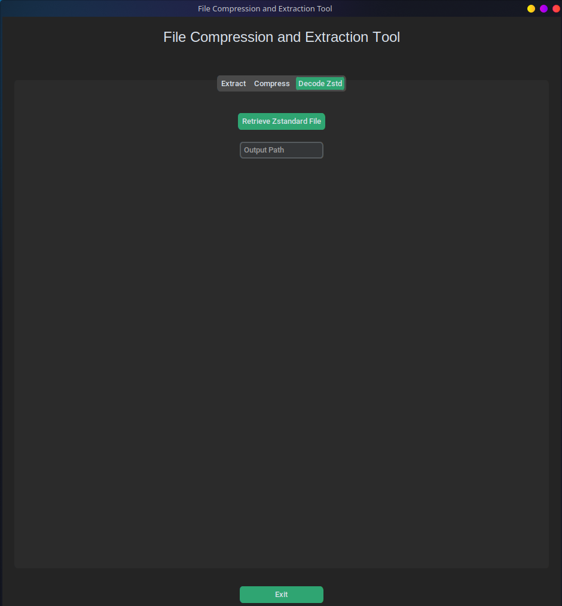
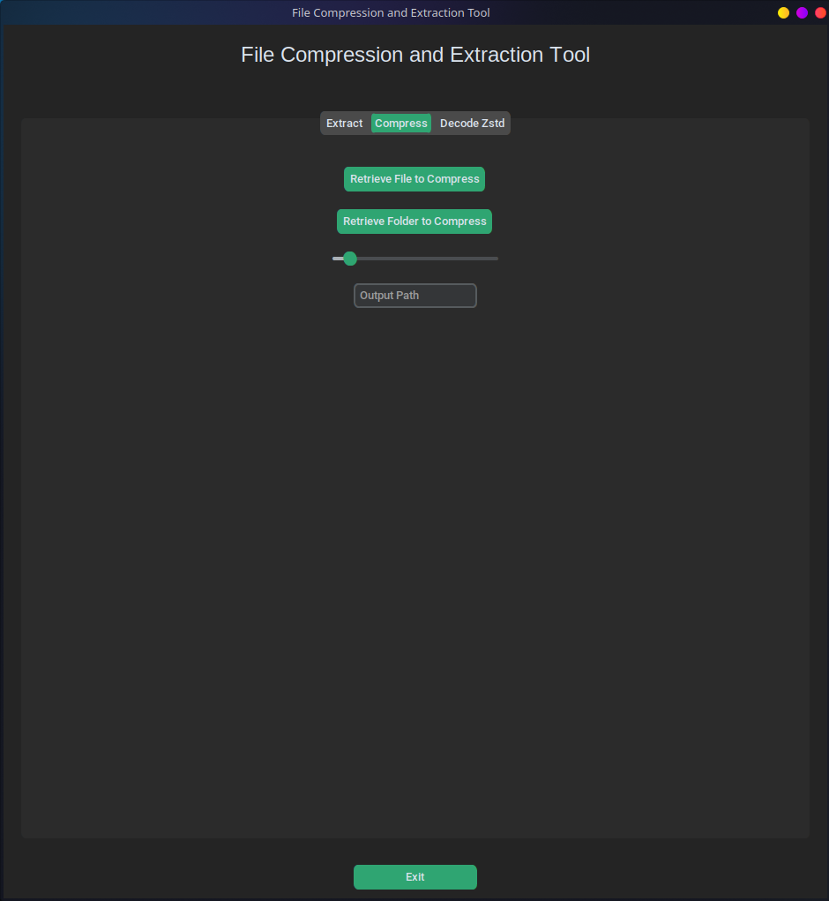

# FileSpacer


**FileSpacer** is a powerful and user-friendly tool for compressing and decompressing files and folders. It supports handling both `zstd` and `zip` formats, and can even extract corrupted zip files!

## 🚀 Features
1. Extract `.zip` files with optional password protection.
2. Compress files and folders using `zstd` with adjustable compression levels.
3. Decompress `.zst` files.
4. **New!** Extract corrupted zip files.

## How to Use

### Extract Zip File

> [!NOTE]
> Make sure your input zip file is valid

1. Click "Retrieve Zip-File" to select a `.zip` file.
   
   

2. Optionally enter a file name to exclude during extraction in "Exclude File".
3. Optionally enter a password for encrypted zip files.
4. Select the output directory.

> [!CAUTION]
> Ensure the correct output directory is selected to prevent overwriting important files.

5. The progress and any messages will be displayed in the terminal output.

### Compress File

1. Click "Retrieve File to Compress" to select a file you want to compress.
   
   

2. Adjust the "Compression Level" slider to set the desired compression level. The higher the number, the more compressed the file will be, but it may take longer.

> [!TIP]
> For most cases, a compression level of 3-5 is a good balance between speed and compression ratio.

3. Enter the output path where the compressed file will be saved.

> [!IMPORTANT]
> Always double-check your output path to ensure it is correct.

4. The progress and any messages will be displayed in the terminal output.

### Compress Folder

1. Click "Retrieve Folder to Compress" to select a folder you want to compress.
2. Adjust the "Compression Level" slider to set the desired compression level. Similar to file compression, higher values mean better compression but slower speeds.
3. Enter the output path where the compressed file will be saved.

> [!WARNING]
> The output file must not be saved inside the folder being compressed, as this will cause errors.

4. The progress and any messages will be displayed in the terminal output.

### Decode Zstd File

1. Click "Retrieve Zstandard File" to select a `.zst` file.
   
   

2. Enter the output path where the decompressed file will be saved.
3. The progress and any messages will be displayed in the terminal output.

## Installation

Make sure to have the following Python libraries installed:

```bash
pip install customtkinter tqdm zstandard
```

## Running the Application

Execute the Python script:

```bash
python filespacer.py
```

## Contributing

> [!TIP]
> Contributions are welcome! Feel free to submit issues, fork the repository, and send pull requests.

Thank you Icon8 for the icon!
<a target="_blank" href="https://icons8.com/icon/qSSG7p6hY0Gu/archive">Archive</a> icon by <a target="_blank" href="https://icons8.com">Icons8</a>


---

We hope this tool makes file compression and extraction easy and efficient for you! 😊

For any issues or contributions, please visit the [repository](https://github.com/tilltmk/filespacer).
